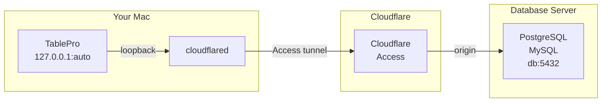

# Cloudflare Tunnel

Cloudflare Tunnel routes your database connection through `cloudflared access tcp` so you can reach a database published behind [Cloudflare Access](https://developers.cloudflare.com/cloudflare-one/). Instead of running cloudflared by hand in a terminal before every session, TablePro starts it when you connect and stops it when you disconnect, the same way it manages [SSH tunnels](/databases/ssh-tunneling).

## How it works



TablePro picks a free loopback port, runs `cloudflared access tcp --hostname <your-host> --url 127.0.0.1:<port>`, waits until the local port accepts connections, then points the database driver at it. When you disconnect, quit the app, or the process exits, the tunnel is torn down.

## Prerequisites

Install cloudflared:

```bash
brew install cloudflared
```

TablePro looks for cloudflared on your `PATH` and in the common Homebrew locations (`/opt/homebrew/bin`, `/usr/local/bin`). If it lives somewhere else, set the path in the pane.

## Setting up

Open the connection form, switch to the **Cloudflare Tunnel** pane, toggle **Enable Cloudflare Tunnel** on, enter the Access **hostname**, choose how to authenticate, then go back to **General** and click **Test Connection**.

A connection uses one tunnel at a time. If the SSH Tunnel is enabled, the pane offers to turn it off.

## Options

### Access application

| Field | Description |
|-------|-------------|
| **Hostname** | The Access application hostname, for example `db.example.com`. This is the `--hostname` cloudflared connects to. |

### Authentication

<Tabs>
  <Tab title="Browser sign-in">
    cloudflared signs in through your browser and caches a token under `~/.cloudflared`. Click **Sign In with Browser** once so the login happens up front; after that, connecting uses the cached token without opening a browser.

    If you connect without a cached token, TablePro detects the sign-in prompt and asks you to sign in, rather than appearing to hang.
  </Tab>
  <Tab title="Service token">
    For unattended connections, enter a Cloudflare Access **service token** (Client ID and Client Secret). TablePro stores them in the macOS Keychain and passes them to cloudflared as environment variables, never on the command line.

    <Warning>
    The Access application policy must use a **Service Auth** rule. If the policy only allows an identity provider, Cloudflare still prompts for a browser sign-in even when a service token is set. This is configured in your Cloudflare Zero Trust dashboard, not in TablePro.
    </Warning>
  </Tab>
</Tabs>

### Local listener

| Option | Description | Default |
|--------|-------------|---------|
| **Choose port automatically** | TablePro picks a free loopback port. Avoids collisions between connections. | On |
| **Local port** | Set a fixed port instead. | - |
| **Expose to local network** | Bind `0.0.0.0` instead of `127.0.0.1`, so other machines on your network can reach the listener. Leave off unless you need it. | Off |

### cloudflared binary

Leave the path blank to auto-detect. The pane shows the detected path, or a hint to install cloudflared if it isn't found. Use **Choose** to point at a specific binary.

## Troubleshooting

### cloudflared not found

Install it with `brew install cloudflared`, or set the binary path in the pane. A GUI app doesn't see your shell's `PATH`, so a custom install location may need to be set explicitly.

### A browser keeps opening on connect

The cached Access token expired (Access sessions are time-limited), or you're using a service token against a policy that isn't set to **Service Auth**. Sign in again, or fix the policy in your Cloudflare Zero Trust dashboard.

### Tunnel didn't become ready

TablePro waits up to 30 seconds for the local port to accept connections. If it times out, the last lines of cloudflared's output are shown. Check the hostname and that the Access application is reachable.
